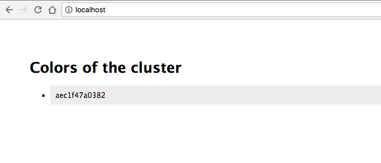
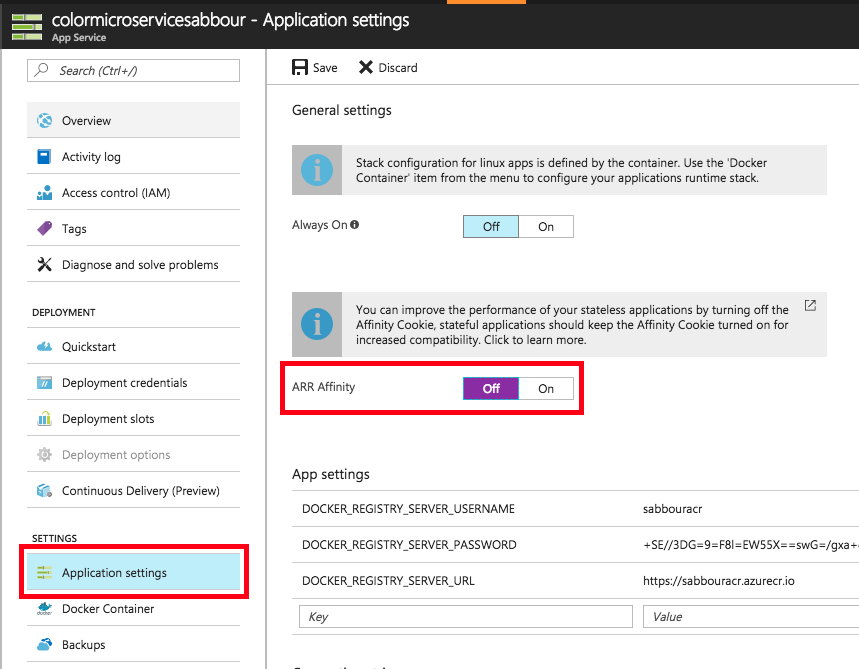
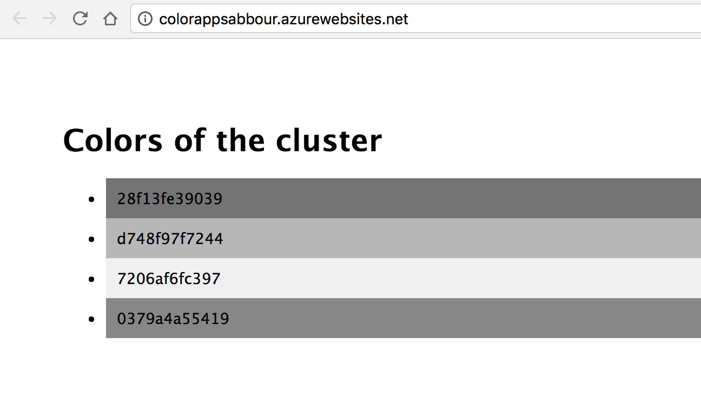

# Continuous Delivery with containers on Azure App Service using Visual Studio Team Services


## Table of Contents

 
## Overview and Pre-Requisites

### Overview

In this lab, you're going to take a Node.js application that is composed of 2 Docker containers and publish it using CI/CD practices to Azure App Service leveraging Visual Studio Team Services. The Docker images you create will be pushed to an instance of Azure Container Registry.

The 2 container components of this lab are:
1. colorapp
2. colormicroservice

Essentially, the **colorapp** does AJAX requests to the **colormicroservice** and plots the results. The **colormicroservice** returns the hostname of the machine in addition to a random hex color.

### Pre-requisites

- Docker installed on your machine
    
    On Windows, install Docker for Windows: https://docs.docker.com/docker-for-windows/install/#install-docker-for-windows 
    
    On a Mac, install Docker for Mac: https://docs.docker.com/docker-for-mac/install/#install-and-run-docker-for-mac 
    
    Then, verify installation:
    ```
    docker -v
    ```
- Visual Studio Code (or your favorite code editor)
    
    On Windows and Mac, download and install from: https://code.visualstudio.com/Download

- Azure CLI installed and configured with your Azure subscription
    
    On Windows, download and install from: https://aka.ms/InstallAzureCliWindows 
    On a Mac, run the below command in Terminal
    ```
    curl -L https://aka.ms/InstallAzureCli | bash
    ```

    Then login into your Azure subscription to verify installation:
    ```
    az login
    ```

    If you have many subscriptions, you may choose one:
    ```
    az account set -s <subscription-GUID>
    ```

    Create the Resource Group to use throughout the lab:
    ```
    az group create -n <rg name> -l westeurope 
    ```

    Set the default Resource Group for your session, to avoid typing it in all commands
    ```
    az configure --defaults group=<rg name>
    ```
- You should also **Fork** this repository as one of the steps would involve you modifying the source code and committing it to trigger the CI/CD pipeline.
 
### Topics Covered

- Running locally
- Pushing Docker images to Azure Container Registry
- Creating Azure App Service and Web App
- Creating staging deployment slot
- Setting up Continuous Delivery
- Scaling


## Lab


### Running locally

**Fork** then clone your forked repository to your machine

Change directory to ```ApplicationModernization/CICDAppServiceVSTS/src```

Build both images
```
docker build -t colorapp colorapp/.
docker build -t colormicroservice colormicroservice/.
```

Run using Docker Compose
```
docker-compose up
```

Browse to http://localhost/


### Pushing Docker images to Azure Container Registry

Create an Azure Container Registry (~2 minutes)
```
az acr create -n <registry name> --admin-enabled --sku Managed_Standard
```

Login into the registry. This will enable your local Docker installation to be able to access the registry.
```
az acr login -n <registry name>
```

Change both image tags to point to the registry
```
docker tag colorapp:latest <registry name>.azurecr.io/<image>:latest
docker tag colormicroservice:latest <registry name>.azurecr.io/<image>:latest
```

Publish your images to the registry
```
docker push <registry name>.azurecr.io/colorapp:latest
docker push <registry name>.azurecr.io/colormicroservice:latest
```

### Creating Azure App Service and Web App

Create the App Service Plan
```
az appservice plan create -n <plan name> --is-linux --sku S1
```
> Note that Web App for Containers doesn't support Docker Compose yet. You'll have to create 2 Web Apps, one for each container.

Create a Web App for Containers for **colorapp**. Change ```<color app name>``` here to something unique.
```
az webapp create -n <color app name> -p <plan name> -i <registry name>.azurecr.io/colorapp
```

Create a Web App for Containers for **colormicroservice**. Change ```<microservice  name>``` here to something unique.
```
az webapp create -n <microservice name> -p <plan name> -i <registry name>.azurecr.io/colormicroservice
```

Get the Azure Container Registry credentials
```
az acr credential show -n <registry name>
```

Update the Web App configurations with Azure Container Registry credentials and container image for both apps.

Due to a bug in the Azure CLI, you also need to explicitly set the image name as an Application Setting.
```
az webapp config container set -n <color app name>
-i <registry name>.azurecr.io/colorapp
-r https://<registry name>.azurecr.io
-u <acr admin username>
-p <acr admin password>

az webapp config appsettings set -n <color app name> --settings DOCKER_CUSTOM_IMAGE_NAME="<registry name>.azurecr.io/colorapp"
```
```
az webapp config container set -n <microservice name>
-i <registry name>.azurecr.io/colormicroservice
-r https://<registry name>.azurecr.io
-u <acr admin username>
-p <acr admin password>

az webapp config appsettings set -n <microservice name> --settings DOCKER_CUSTOM_IMAGE_NAME="<registry name>.azurecr.io/colormicroservice"
```

Configure the ```COLORMICROSERVICE``` environment variable on the **colorapp** Web App to point to the **colormicroservice**. This is how the application is configured to call the microservice through ```process.env.COLORMICROSERVICE```.
```
az webapp config appsettings set -n <color app name> --settings COLORMICROSERVICE="http://<microservice name>.azurewebsites.net/colors"
```


Open the Azure Portal, and browse to the **colormicroservice** Web App, click on Application settings and turn off ARR Affinity. This will enable any of the deployed instances of the microservice to respond to requests.


Browse to the Web App [http://<color app name\>.azurewebsites.net](http://webappname.azurewebsites.net). It may take a short while for the first load as the Docker image is being pulled.

You should see the app running.


### Create **staging** deployment slot for the **colormicroservice**

Create the staging slot, copying the configuration from the current **colormicroservice** production slot.
```
az webapp deployment slot create -n <microservice name> -s staging --configuration-source <microservice name>
```

### Configure Continuous Delivery

You're now going to use the Azure Portal to easily configure a Continuous Build/Continuous deployment pipeline. This is going to be configured on Visual Studio Team Services.




After you push the new code, VSTS will build a new Docker image and push it to the Azure Container Registry.


Following this, VSTS will run the Release to deploy to the staging slot of the **colorapp**. If you go ahead and continue the release, this will do a slot swap, and you should see your app starting to show some color, while the old grayscale labels will not be updating anymore.


### Scaling your cluster
Now, scale the App Service Plan to more instances either using the Azure Portal or by executing the command below.
```
az appservice plan update --number-of-workers 4 -n <plan name>
```

In a few moments, as the Docker images are being pulled and deployed on new VMs, you should see more instances lighting up on your screen.


If you run into trouble, you can view the streaming logs using the following command.
```
az webapp log config -n <web app name> --web-server-logging filesystem
az webapp log tail -n <web app name>
```

## Conclusion

In this lab, you created a private Docker image repository on Azure Container Registry and pushed an application image to it. You also created an App Service Plan running Linux and a Web App that is configured to pull that Docker image. 


## End your Lab

Clean up your lab by deleting the Resource Group you created.
```
az group delete -n <rg name>
```

## Additional Resources and References

- [Azure Container Registry](https://docs.microsoft.com/en-us/azure/container-registry/)
- [Azure App Service Linux](https://docs.microsoft.com/en-us/azure/app-service/app-service-linux-readme)
- [Continuous deployment with Azure Web Apps for Containers](https://docs.microsoft.com/en-us/azure/app-service/containers/app-service-linux-ci-cd)


## License

Copyright (c) Microsoft Corporation. All rights reserved.

Licensed under the [MIT](LICENSE) License.
