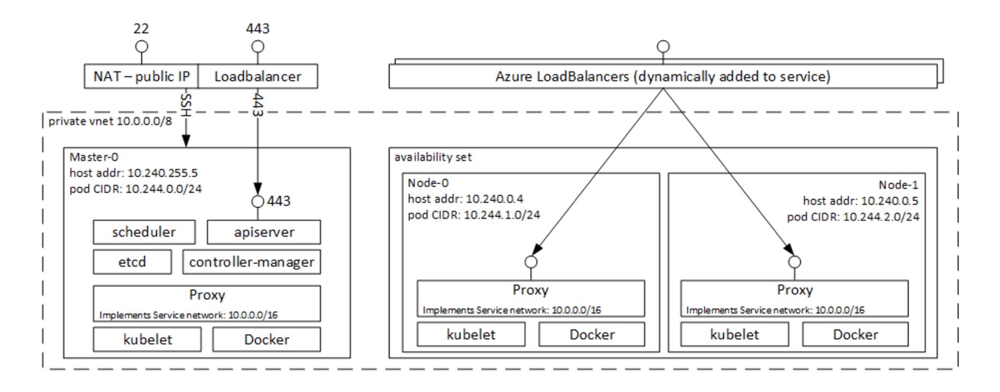
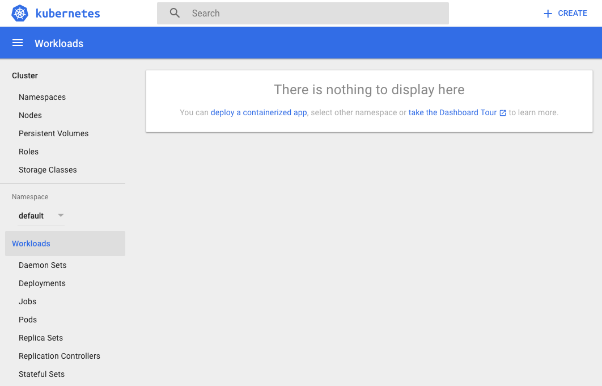
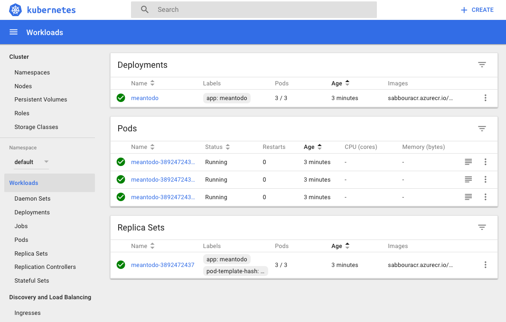

# Containers on Azure Container Service with Kubernetes


## Table of Contents

   


## Overview and Pre-Requisites

### Overview

In this lab, you're going to take a MEAN app (MongoDB, Express.js, AngularJS and Node.js) that is "Dockerized" with a Dockerfile and deploy it to Azure Container Service running Kubernetes as the orchestrator. The Docker image you create will be pushed to an instance of Azure Container Registry.




> The application being deployed is a Dockerized version of [node-todo](https://github.com/scotch-io/node-todo) by [@scotch-io](https://github.com/scotch-io)

### Pre-requisites

- Docker installed on your machine
    
    On Windows, install Docker for Windows: https://docs.docker.com/docker-for-windows/install/#install-docker-for-windows 
    
    On a Mac, install Docker for Mac: https://docs.docker.com/docker-for-mac/install/#install-and-run-docker-for-mac 
    
    Then, verify installation:
    ```
    docker -v
    ```
- Visual Studio Code (or your favorite code editor)
    
    On Windows and Mac, download and install from: https://code.visualstudio.com/Download
    
    Then, verify installation:
    ```
    code --version
    ```

    Install Docker extension for VS Code (optional)
    

- Azure CLI installed and configured with your Azure subscription
    
    On Windows, download and install from: https://aka.ms/InstallAzureCliWindows 
    On a Mac, run the below command in Terminal
    ```
    curl -L https://aka.ms/InstallAzureCli | bash
    ```

    Then login into your Azure subscription to verify installation:
    ```
    az login
    ```

    If you have many subscriptions, you may choose one:
    ```
    az account set -s <subscription-GUID>
    ```

    Create the Resource Group to use throughout the lab:
    ```
    az group create -n <rg name> -l westeurope 
    ```

    Set the default Resource Group for your session, to avoid typing it in all commands
    ```
    az configure --defaults group=<rg name>
    ```

### Topics Covered

- Running locally
- Pushing Docker images to Azure Container Registry
- Creating CosmosDB database with MongoDB adapter
- Creating the Kubernetes cluster on Azure Container Service
- Deploying the container to the Kubernetes cluster


## Lab


### Running locally

Clone the current repository to your machine

Change directory to ```ApplicationModernization/ContainersOnACSKubernetes```

Open the ```src/Dockerfile``` in your code editor, and review it

Build the image, tagging it as **meantodo**
```
docker build -t meantodo src/.
```

Run the image locally
```
docker run –p 8080:8080 meantodo
```

Browse to http://localhost:8080/

### Pushing Docker images to Azure Container Registry

Create an Azure Container Registry (~2 minutes)
```
az acr create -n <registry name> --admin-enabled --sku Managed_Standard
```

<!---
Create a new service principal and assign access:
```
az ad sp create-for-rbac --scopes /subscriptions/90ab3701-83f0-4ba1-a90a-f2e68683adab/resourceGroups/sabbourrglab/providers/Microsoft.ContainerRegistry/registries/sabbouracr --role Owner --password <password>
```
-->

Login into the registry. This will enable your local Docker installation to be able to access the registry.
```
az acr login -n <registry name>
```

Change your image tag to point to the registry
```
docker tag <image>:latest <registry name>.azurecr.io/<image>:latest
```

Publish your image to the registry
```
docker push <registry name>.azurecr.io/<image>:latest
```

### Creating CosmosDB database with MongoDB adapter

In your terminal, type the following command to create the MongoDB database (~5 minutes)
```
az cosmosdb create -n <mongo name> --kind MongoDB
```

### Creating the Kubernetes cluster on Azure Container Service

Create the ACS cluster with Kubernetes as the orchestrator (~ 10 mins)
```
az acs create -n <acs name> -t kubernetes --generate-ssh-keys
```

Install ```kubectl```. On Windows, add ```C:\Program Files (x86)\``` to your **PATH** then restart the CMD prompt

```
az acs kubernetes install-cli
```

Get the cluster credentials
```
az acs kubernetes get-credentials -n <acs name>
```

Browse to the Kubernetes dashboard
```
az acs kubernetes browse -n  <acs name>
```

You should be able to view the Kubernetes dashboard running as in the following screenshot.



### Deploying the container to the Kubernetes cluster

Get the MongoDB connection string
```
az cosmosdb list-connection-strings -n <mongo name>
```
> Make note of this connection string as you'll need to paste it in the application configuration later on.

Get the Azure Container Registry username and password
```
az acr credential show -n <acr name>
```

Register the Azure Container Registry secret within Kubernetes
```
kubectl create secret docker-registry <acr name>
--docker-server=<acr name>.azurecr.io
--docker-username=<your acr admin username>
--docker-password=<your acr admin password>
--docker-email=<your email>
```

Examine the ```src/meantodo.yaml``` file which should be like the below, replace ```<acr name>``` with your Azure Container Registry name and ```<mongo connection string>``` with the connection string you obtained from the earlier steps.
> Note the ```imagePullSecrets``` property. This tells Kubernetes what is the name of the secret you just configured to allow it to pull the image from your Azure Container Registry.

```YAML
apiVersion: apps/v1beta1
kind: Deployment
metadata:
  name: meantodo
spec:
  replicas: 3
  template:
    metadata:
      labels:
        app: meantodo
    spec:
      containers:
      - name: meantodo
        image: <acr name>.azurecr.io/meantodo
        ports:
        - containerPort: 8080
        env:
        - name: MONGO_URL
          value: "<mongo connection string>"
      imagePullSecrets:
      -- name: <acr name>
---
apiVersion: v1
kind: Service
metadata:
  name: meantodo
spec:
  type: LoadBalancer
  ports:
    - port: 80
      targetPort: 8080
      protocol: TCP
  selector:
    app: meantodo
```

The definition above deploys your container to 3 nodes that are load balanced on port 80 using an Azure Load Balancer.

Run the deployment via
```
kubectl create -f src/meantodo.yaml --record
```

Run the command below and wait for a couple of minutes to get the app’s ```EXTERNAL-IP``` then view in the browser. Replace ```<service name>``` with the name of the service defined in the ```meantodo.yaml``` file. In this example, it is **meantodo**.
```
kubectl get service <service name> --watch
```

You should now see the pods running in your Kubernetes dashboard.



Browse to the app on the **EXTERNAL-IP**.


## Conclusion

In this lab, you created a private Docker image repository on Azure Container Registry and pushed an MEAN application image to it. You also created an Azure Container Service running Kubernetes as the orchestrator and deployed the app to a Replica Set of 3 pods. For the database, you created a MongoDB on top of CosmosDB.


## End your Lab

Clean up your lab by deleting the Resource Group you created.
```
az group delete -n <rg name>
```

## Additional Resources and References

- [Azure Container Registry](https://docs.microsoft.com/en-us/azure/container-registry/)
- [Azure App Service Linux](https://docs.microsoft.com/en-us/azure/app-service/app-service-linux-readme)
- [Azure Cosmos DB](https://docs.microsoft.com/en-us/azure/cosmos-db/)


## License

Copyright (c) Microsoft Corporation. All rights reserved.

Licensed under the [MIT](LICENSE) License.