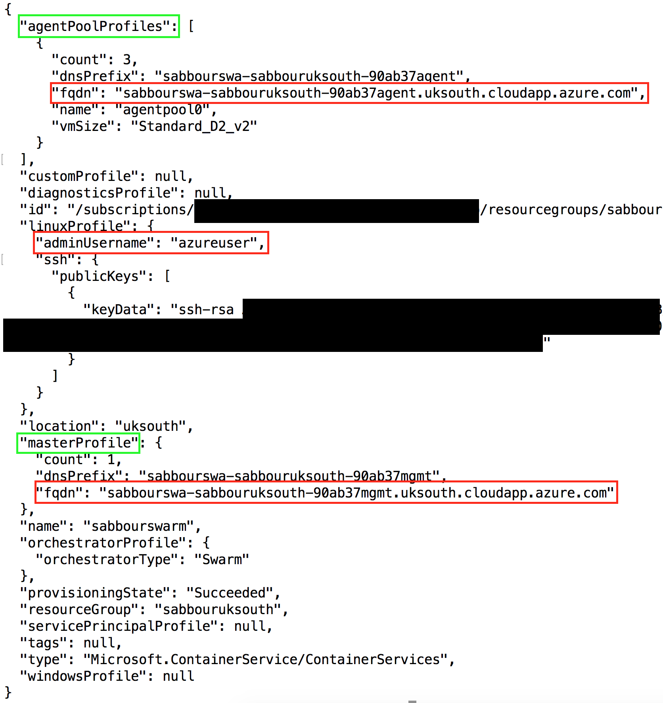
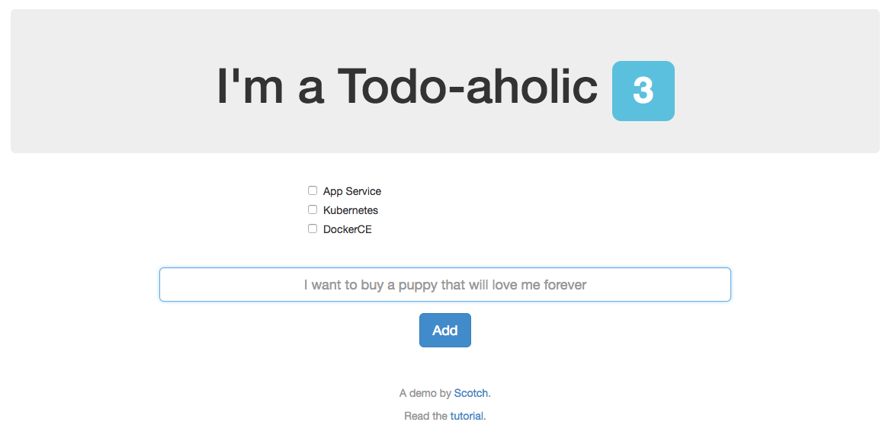

# Containers on Azure Container Service with DockerCE (Swarm Mode)


## Table of Contents

   * [Containers on Azure Container Service with DockerCE (Swarm Mode)](#containers-on-azure-container-service-with-dockerce-swarm-mode)
      * [Table of Contents](#table-of-contents)
      * [Overview and Pre-Requisites](#overview-and-pre-requisites)
         * [Overview](#overview)
         * [Pre-requisites](#pre-requisites)
         * [Topics Covered](#topics-covered)
      * [Lab](#lab)
         * [Running locally](#running-locally)
         * [Pushing Docker images to Azure Container Registry](#pushing-docker-images-to-azure-container-registry)
         * [Creating CosmosDB database with MongoDB adapter](#creating-cosmosdb-database-with-mongodb-adapter)
         * [Creating the DockerCE (Swarm Mode) cluster on Azure Container Service](#creating-the-dockerce-swarm-mode-cluster-on-azure-container-service)
         * [Deploying the container to the DockerCE (Swarm Mode) cluster](#deploying-the-container-to-the-dockerce-swarm-mode-cluster)
      * [Conclusion](#conclusion)
      * [End your Lab](#end-your-lab)
      * [Additional Resources and References](#additional-resources-and-references)
      * [License](#license)


## Overview and Pre-Requisites

### Overview

In this lab, you're going to take a MEAN app (MongoDB, Express.js, AngularJS and Node.js) that is "Dockerized" with a Dockerfile and deploy it to Azure Container Service running DockerCE (Swarm Mode) as the orchestrator. The Docker image you create will be pushed to an instance of Azure Container Registry.

> Note that Swarm Mode is deployed in a limited number of Azure regions today. Namely: **ukwest** and **uksouth**. The team [announced](https://github.com/Azure/ACS/blob/master/announcements/2017-08-04_additional_regions.md) that other regions are now supported, but you would need to use the [nightly build of the Azure CLI tools](https://github.com/Azure/azure-cli#nightly-builds) for that to work. Make sure you create your Resource Group in one of those regions. Optionally, you may also use [acs-engine](https://github.com/Azure/acs-engine) to provision in a region of your choice.

For the purpose of this lab, go ahead and choose **uksouth** as your Resource Group location.


> The application being deployed is a Dockerized version of [node-todo](https://github.com/scotch-io/node-todo) by [@scotch-io](https://github.com/scotch-io)

### Pre-requisites

- Docker installed on your machine
    
    On Windows, install Docker for Windows: https://docs.docker.com/docker-for-windows/install/#install-docker-for-windows 
    
    On a Mac, install Docker for Mac: https://docs.docker.com/docker-for-mac/install/#install-and-run-docker-for-mac 
    
    Then, verify installation:
    ```
    docker -v
    ```
- Visual Studio Code (or your favorite code editor)
    
    On Windows and Mac, download and install from: https://code.visualstudio.com/Download
    
    Then, verify installation:
    ```
    code --version
    ```

    Install Docker extension for VS Code (optional)
    

- Azure CLI installed and configured with your Azure subscription
    
    On Windows, download and install from: https://aka.ms/InstallAzureCliWindows 
    On a Mac, run the below command in Terminal
    ```
    curl -L https://aka.ms/InstallAzureCli | bash
    ```

    Then login into your Azure subscription to verify installation:
    ```
    az login
    ```

    If you have many subscriptions, you may choose one:
    ```
    az account set -s <subscription-GUID>
    ```

    Create the Resource Group to use throughout the lab:
    ```
    az group create -n <rg name> -l uksouth 
    ```

    Set the default Resource Group for your session, to avoid typing it in all commands
    ```
    az configure --defaults group=<rg name>
    ```

### Topics Covered

- Running locally
- Pushing Docker images to Azure Container Registry
- Creating CosmosDB database with MongoDB adapter
- Creating the DockerCE (Swarm Mode) cluster on Azure Container Service
- Deploying the container to the DockerCE (Swarm Mode) cluster


## Lab


### Running locally

Clone the current repository to your machine

Change directory to ```ApplicationModernization/ContainersOnACSDockerCE```

Open the ```src/Dockerfile``` in your code editor, and review it

Build the image, tagging it as **meantodo**
```
docker build -t meantodo src/.
```

Run the image locally
```
docker run –p 8080:8080 meantodo
```

Browse to http://localhost:8080/

### Pushing Docker images to Azure Container Registry

Create an Azure Container Registry (~2 minutes)
```
az acr create -n <registry name> --admin-enabled --sku Managed_Standard -l westeurope
```
> Note that at the time of this writing, Azure Container Registry was not available in **uksouth**, hence you need to explicitly create it in one of the supported regions, such as **westeurope**.

<!---
Create a new service principal and assign access:
```
az ad sp create-for-rbac --scopes /subscriptions/90ab3701-83f0-4ba1-a90a-f2e68683adab/resourceGroups/sabbourrglab/providers/Microsoft.ContainerRegistry/registries/sabbouracr --role Owner --password <password>
```
-->

Login into the registry. This will enable your local Docker installation to be able to access the registry.
```
az acr login -n <registry name>
```

Change your image tag to point to the registry
```
docker tag <image>:latest <registry name>.azurecr.io/<image>:latest
```

Publish your image to the registry
```
docker push <registry name>.azurecr.io/<image>:latest
```

### Creating CosmosDB database with MongoDB adapter

In your terminal, type the following command to create the MongoDB database (~5 minutes)
```
az cosmosdb create -n <mongo name> --kind MongoDB
```

### Creating the DockerCE (Swarm Mode) cluster on Azure Container Service

Create the ACS cluster with DockerCE (Swarm Mode) as the orchestrator (~ 10 mins)
```
az acs create -n <acs name> -t dockerce --generate-ssh-keys
```

Get the  admin username, Master FQDN and Agent FQDN. You'll need them in the next steps.
```
az acs show -n <acs name>
```


Create an SSH tunnel to the Master node. Choose a free local port (for example 2376). Specify the admin username and master FQDN.
```
ssh -fNL <local port>:localhost:2375 -p 2200 <admin username>@<master FQDN>
```
then ```export DOCKER_HOST=:<local port>```

If you are using Windows: Use PuTTy. Check here https://docs.microsoft.com/en-us/azure/container-service/kubernetes/container-service-connect#connect-to-a-dcos-or-swarm-cluster 

### Deploying the container to the DockerCE (Swarm Mode) cluster

Get the MongoDB connection string
```
az cosmosdb list-connection-strings -n <mongo name>
```
> Make note of this connection string as you'll need to paste it in the application configuration later on.

Examine the ```src/docker-compose.yaml``` file which should be like the below, replace ```<acr name>``` with your Azure Container Registry name and ```<mongo connection string>``` with the connection string you obtained from the earlier steps.

```YAML
version: '3'

services:
  web:
    image: <acr name>.azurecr.io/meantodo
    ports:
      - 80:8080
    environment:
      - MONGO_URL=<mongo connection string>
```

Deploy the stack via the following command. Replace ```<stack name>``` with something to identify this deployment, for example **meantodo**.
```
docker stack deploy --with-registry-auth --compose-file src/docker-compose.yml <stack name>
```

Browse to the agent's FQDN you obtained from the earlier steps [http://<agent dns name\>.<region\>.cloudapp.azure.com](http://.cloudapp.azure.com)

You should see the app running.



## Conclusion

In this lab, you created a private Docker image repository on Azure Container Registry and pushed an MEAN application image to it. You also created an Azure Container Service running DockerCE (Swarm Mode) as the orchestrator. For the database, you created a MongoDB on top of CosmosDB.


## End your Lab

Clean up your lab by deleting the Resource Group you created.
```
az group delete -n <rg name>
```

## Additional Resources and References

- [Azure Container Registry](https://docs.microsoft.com/en-us/azure/container-registry/)
- [Azure Container Service with DockerCE](https://github.com/Azure/acs-engine/blob/master/docs/swarmmode.md)
- [acs-engine](https://github.com/Azure/acs-engine/)
- [Azure Cosmos DB](https://docs.microsoft.com/en-us/azure/cosmos-db/)


## License

Copyright (c) Microsoft Corporation. All rights reserved.

Licensed under the [MIT](LICENSE) License.